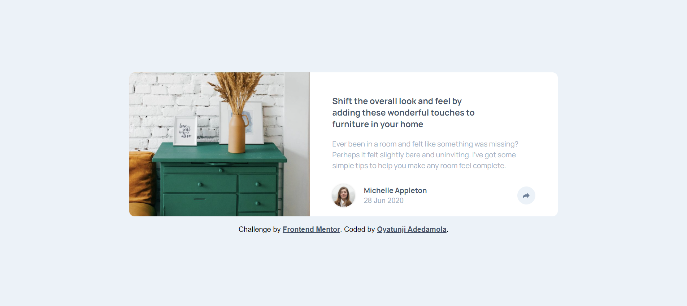
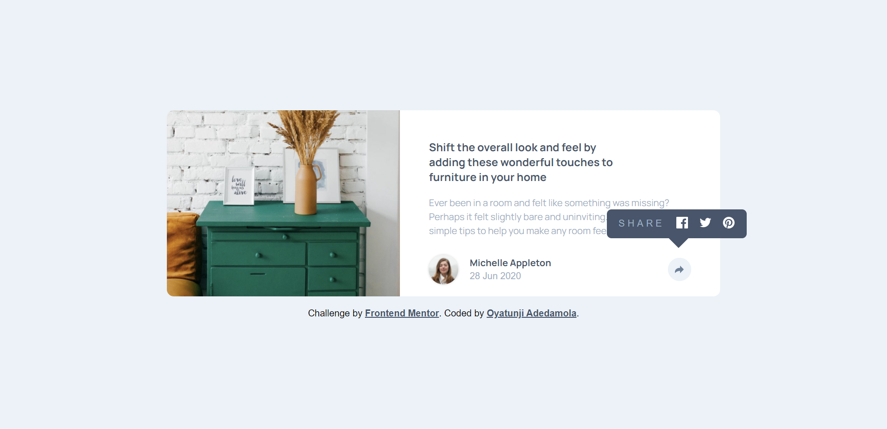
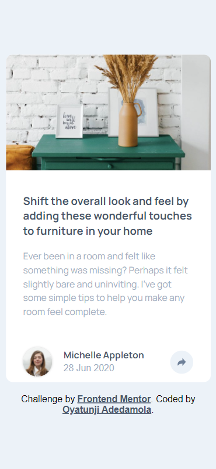
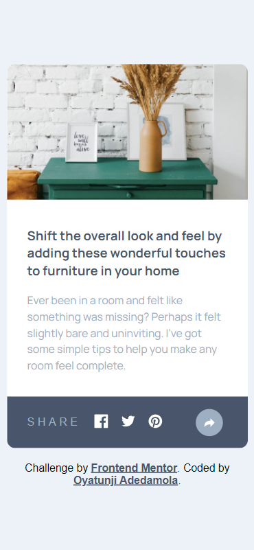

# Frontend Mentor - Article preview component solution

This is a solution to the [Article preview component challenge on Frontend Mentor](https://www.frontendmentor.io/challenges/article-preview-component-dYBN_pYFT). Frontend Mentor challenges help you improve your coding skills by building realistic projects. 

## Table of contents

- [Overview](#overview)
  - [The challenge](#the-challenge)
  - [Screenshot](#screenshot)
  - [Links](#links)
- [My process](#my-process)
  - [Built with](#built-with)
  - [What I learned](#what-i-learned)
- [Author](#author)

**Note: Delete this note and update the table of contents based on what sections you keep.**

## Overview

### The challenge

Users should be able to:

- View the optimal layout for the component depending on their device's screen size
- See the social media share links when they click the share icon

### Screenshot







### Links

- Solution URL: [Add solution URL here](https://your-solution-url.com)
- Live Site URL: [Add live site URL here](https://your-live-site-url.com)

### My Process

### Built with

- Semantic HTML5 markup
- CSS custom properties
- Flexbox
- SCSS
- CSS Grid
- Mobile-first workflow


### What I learned

```js
const button = document.getElementById('mainShare');
const buttonTwo = document.getElementById('innerShare');
const social = document.querySelector('.social')

button.addEventListener('click', () => {
    social.classList.toggle('active');
})

buttonTwo.addEventListener('click', ()=> {
    social.classList.remove('active');
})
```

If you want more help with writing markdown, we'd recommend checking out [The Markdown Guide](https://www.markdownguide.org/) to learn more.

**Note: Delete this note and the content within this section and replace with your own learnings.**


## Author

- Website - [Oyatunji Adedamola](https://github.com/dedribble)
- Frontend Mentor - [@dedribble](https://www.frontendmentor.io/profile/dedribble)
- Twitter - [@dedribble](https://www.twitter.com/dedribble)


